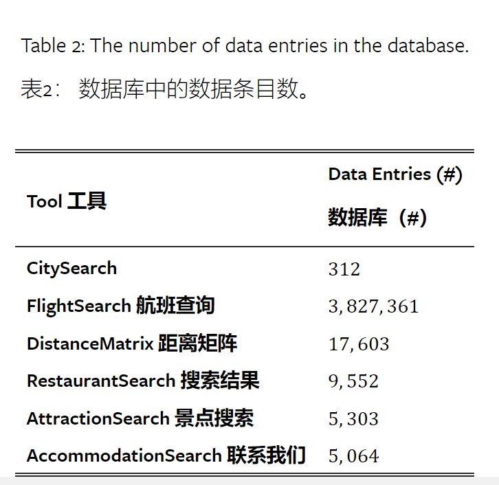
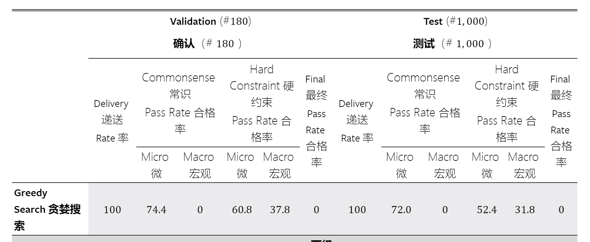
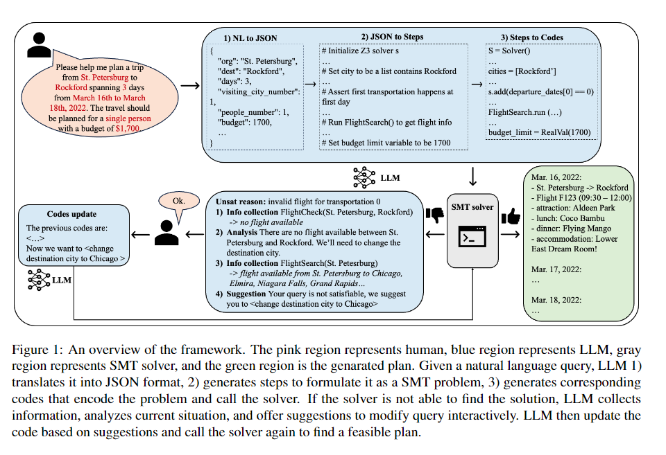
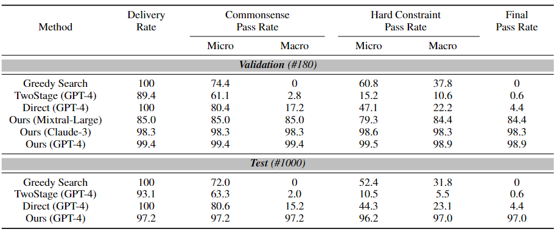

---

layout: post 

title: TraverPlanner

---

## [TravelPlanner: A Benchmark for Real-World Planning with Language Agents](https://arxiv.org/abs/2402.01622)
分为两种规划方法：

- two-stage: 首先使用FlightSearch这些工具，然后根据所搜索到的结果再进行规划
- sole：将需要规划的信息直接提供给LLM，然后进行规划

规划中有一些约束：
Environmental-Constraint: 两地之间没有交通工具，没有对应的景点
Commonsense Constraint:不能提供数据集中没有的城市，信息要完整（如不能出现一天没有住宿的情况），交通工具选择合理
Hard-Constraint: 总预算，住宿要求，饮食要求

得出的结论是及时是GPT4也只有0.6%的通过率，单纯通过LLM和数据库进行Travel Plan是不可行的
并没有在文章中看到有关训练的具体细节，没有搞懂是怎么进行训练的，这篇文章似乎是提出和尝试解决了一个问题

## [Large Language Models Can Plan Your Travels Rigorously with FormalVerification Tools](https://arxiv.org/abs/2404.11891)

在上篇文章的基础上进行了改进，首先将用户的自然语言转为JSON，然后在LLM的帮助下一步步将JSON转化为SMT solver的代码判断数据库中的信息是否能够满足这个规划，再通过LLM整理信息进行输出。这样就解决了two-stage中LLM无法理解并使用工具的问题

这样的结果得出的正确率很高

[SMT solver](https://www.youtube.com/watch?v=UmAZMVrJnHM&list=PLqinEaadXCHYW_1Z3W05rNx0skQIxrmQB)

推荐系统，用户的template

## [ProAgent: Building Proactive Cooperative Agents with Large Language Models](https://pku-proagent.github.io/)

利用LLM提出了一种新的multi-agent系统，可以和不熟悉的队友或者人类进行较好的合作。（基于overcooked-ai进行测试）


主要由四部分组成

- Planner Moudle: 遵循CoT(Chain of Thought)方法，一步一步做出最终决定

- Verificator Moudle: 利用多轮验证器分析，使用三轮提示和相应方法：Preconditions check(在真正决策前判断当前计划是否合法，例如“分析在当前情景中我为什么不能逐步执行此技能”), double check, Error Conclusion。验证器模块的轮数和交互风格没有特定的约束，重点是通过检查和判定，分解在收到外部环境的负面反馈时，如何为当前代理重新规划。

- Belief Correction: 预测队友未来的行为，将分析储存在记忆中，如果出现队友行为偏差的情况，则可以采用两种方法：用队友的实际行动替换预测或者在原始预测旁添加标注，记为不正确，这样会随着时间的迭代完善对于队友的belief使得预测更加准确
- Controller Moudle: 将高级的技能规划与底层的动作结合起来，**文章直接使用了overcooked-ai内置的控制器**。

实验过程

在*Cramped Room*, *Asymmetric Advantages*, *Forced Coordination*, *Coordination Ring*, and *Counter Circuit*五种场景中进行测试

AI-AI：用SP, PBT, FCP, MEP,COLE,和proAgent彼此配对测试平均性能，结果为proAgent作为player 0时性能优于所有算法，作为player 1时在Cramped Room中不如FCP，在Forced Coordination中不如PBT

AI-Human


*Figure 2:Performance with human proxy partners. In each layout, the reward bar represents the average performance of one algorithm collaborating with the unseen human proxy partners over 400 timesteps on five BC models, and the error lines represent the standard error. The hashed bars indicate the rewards obtained where the starting positions are switched.*

ps: 

- 发现知识库的最佳组合为task,rules, demos

```python
### Task:
- The task requires two players player0 and player1 to work together as a team …
- To get the points, the team needs to …
…
### Rules:
In this task, each player can ONLY perform the following skills: [skill 1], [skill 2], …
def skill_1(obj):
    [function detail]
def skill_2(obj, obj):
    [function detail]
…
Suppose you are an assistant who is proficient in the task. Your goal is to control player0 and cooperate with player1 who is controlled by a certain strategy to get a high score and should follow:
- [Rule 1].
- [Rule 2].
…
- Based on the current scene, you need to achieve
- [Target 1].
- [Target 2].
…
Your response should be in the following format:
- Analysis:[your analysis of the current scene]
- Plan for Player 0: [one skill in [skill 1, skill 2…]]
…
### Demos:
Scene 0: [Player0 state 0]. [Player1 state 0]. [Other task information]
Analysis: Both Player0 and Player1 are [State description]. I guess two players will [Some skill].
[Target 1]: [Some skill].
[Target 2]: [Some skill].
…
Scene 39: [Player0 state 39]. [Player1 state 39]. [Other task information]
Analysis: Player0 is [State description]. Player1 is [State description]. I guess …
…
```

- 原始符号与自然语言对齐

```python
### Original State
        ___________________________________
        |X       X       P       X       X|
        |                                 |
        |O       ←0o     ←1o               O|
        |                                 |
        |X                               X|
        |                                 |
        |X       D       X       S       X|
        ———————————–
### Language State (Layout)
Above is the layout of the kitchen: onion dispenser at (0, 1), onion dispenser at (4, 1), dish dispenser at (1, 3), pot at (2, 0), serving loc at (3, 3).
### Language State (Task state)
State: Player 0 holds one onion. Player 1 holds one onion. Kitchen states: Pot (2, 0) is empty.
```

