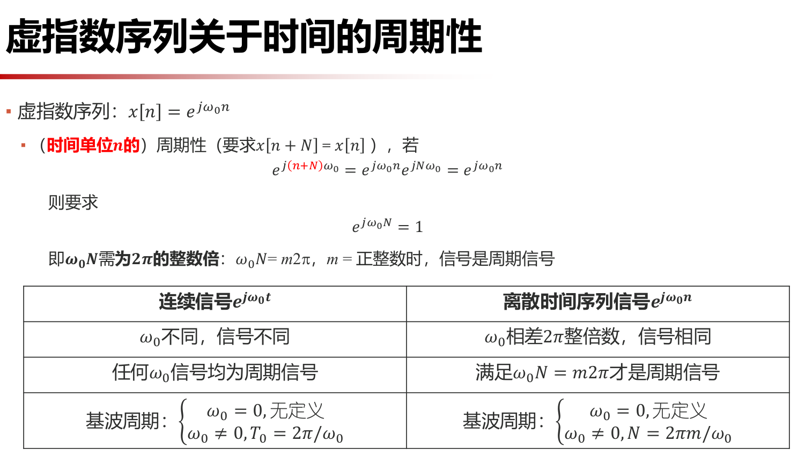

---

layout: post 

title: 数字信号处理

---
[lamda](https://www.lamda.nju.edu.cn/yehj/dsp2021/?AspxAutoDetectCookieSupport=1)

## 信号的时域分析

- 周期信号𝑥(𝑡)，𝑦(𝑡)的周期为𝑇1 和𝑇2 ，若周期之比𝑇1 /𝑇2 为有理数，则其和信号𝑥(𝑡) + 𝑦(𝑡)仍然是周期信号，其周期为𝑇1 和𝑇2 的最小公倍数。

- 两连续周期信号之和不一定是周期信号，而两周期序列之和一定是周期序列。
- 正弦序列不一定是周期序列

**能量信号与功率信号**

能量信号功率为0,能量是有限的

功率信号能量无限，功率有限

- 信号可能即不是功率信号，也不是功率信号
- 周期信号都是功率信号

